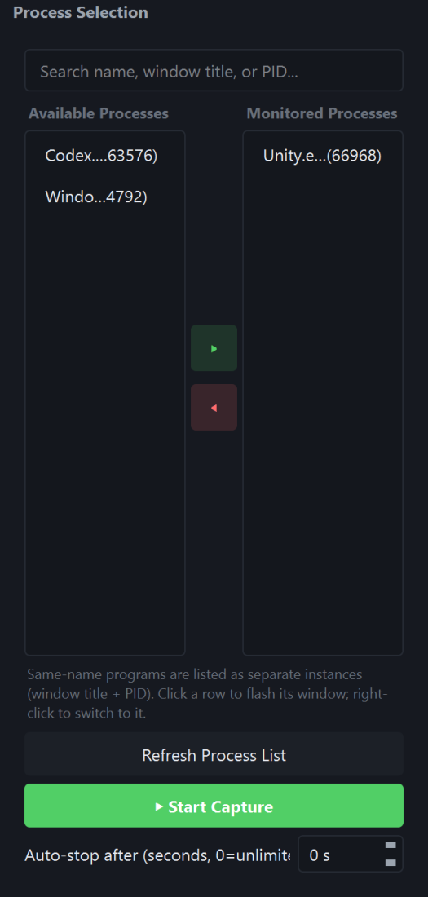
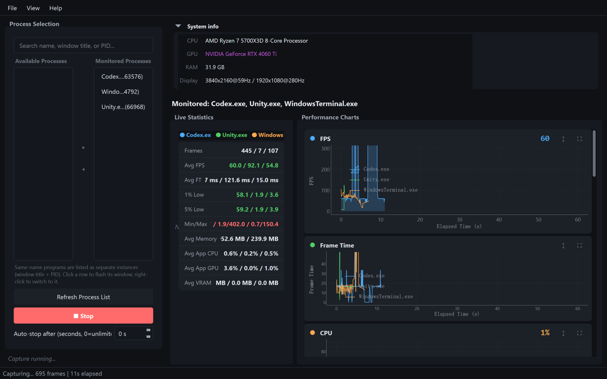
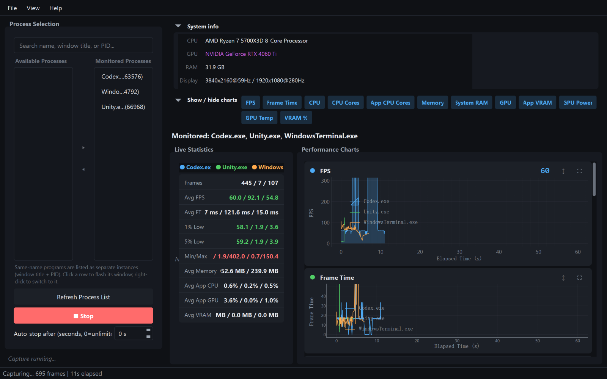
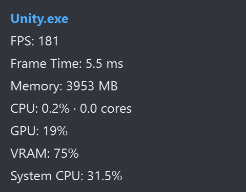
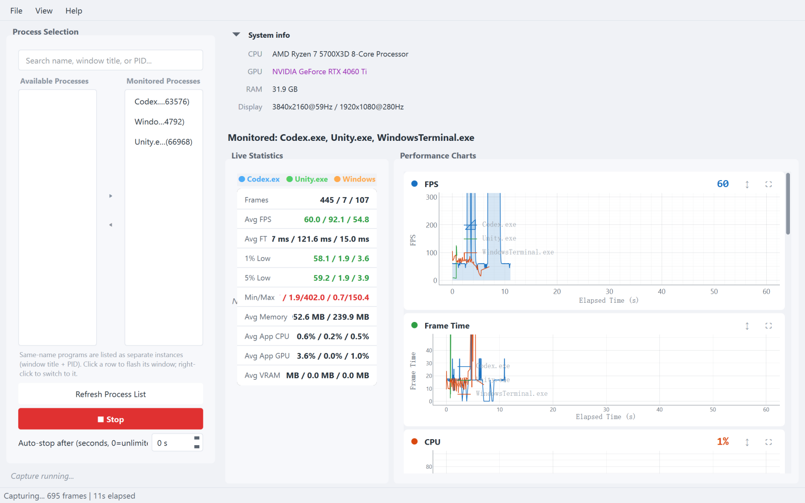
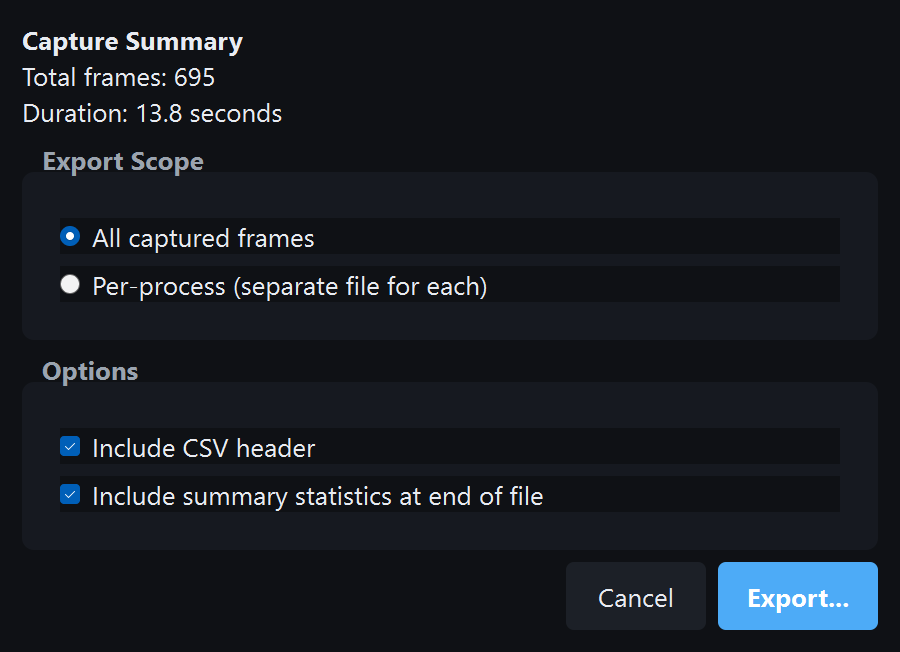
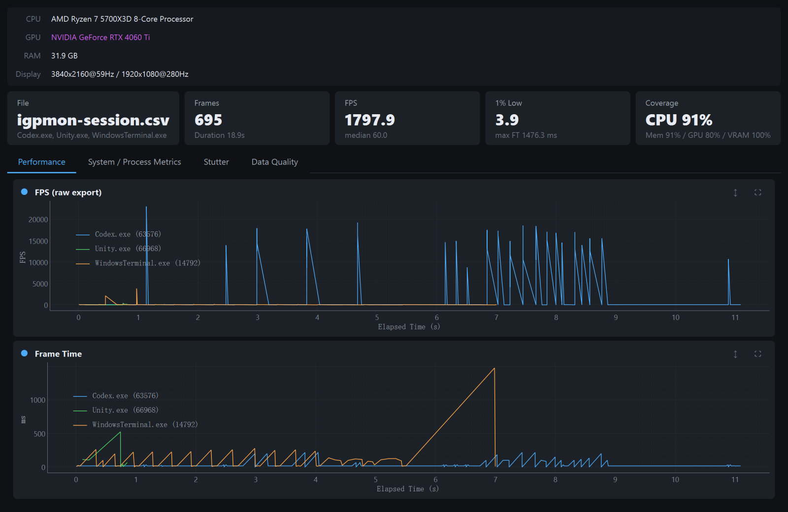

# User guide

[English](README.md) · [简体中文](../zh-CN/user-guide.md) · [繁體中文](../zh-TW/user-guide.md) · [日本語](../ja/user-guide.md)

How to use the packaged Windows app. This file is also **Help → User Manual** inside the program. For install assets and building from source, see [README](README.md). If something fails, see [Troubleshooting](troubleshooting.md).

## Contents

1. [What you need](#1-what-you-need)
2. [Install and first launch](#2-install-and-first-launch)
3. [First capture](#3-first-capture)
4. [Main window](#4-main-window)
5. [Live statistics](#5-live-statistics)
6. [Charts](#6-charts)
7. [Overlay](#7-overlay)
8. [Theme and window](#8-theme-and-window)
9. [Export CSV](#9-export-csv)
10. [Import CSV and offline analysis](#10-import-csv-and-offline-analysis)
11. [Updates and rollback](#11-updates-and-rollback)
12. [UI language](#12-ui-language)
13. [Keyboard shortcuts](#13-keyboard-shortcuts)
14. [Headless / command line](#14-headless--command-line)
15. [Settings and logs](#15-settings-and-logs)
16. [Metric glossary](#16-metric-glossary)

## 1. What you need

- Windows 10 or 11, 64-bit
- **Administrator** rights, or membership in *Performance Log Users*
- The game or app already running (or start it, then click **Refresh Process List**)
- NVIDIA GPU if you want GPU %, VRAM, power, and temperature from NVML. Frame time and FPS still work on other GPUs via PresentMon.

The app uses [Intel PresentMon](https://github.com/GameTechDev/PresentMon) 2.4.1 and Event Tracing for Windows (ETW). That is why elevation is required. Every entry point asks for admin if you are not already elevated.

## 2. Install and first launch

### Installer

1. Download `IGPPerformanceMonitor-Setup-x.y.z.exe` from [Releases](https://github.com/MlsMoon/IGPPerformanceMonitor/releases/latest).
2. Run the installer (UAC prompt). It writes to Program Files and adds a Start Menu shortcut.
3. Launch **IGP Performance Monitor**. Approve UAC if asked.

### Portable EXE

Portable option: run `IGPPerformanceMonitor.exe` from any folder. Right-click → **Run as administrator** if Windows does not elevate automatically.

`auto_updater.exe` is an internal helper. Do not start it by hand.

About 1.5 seconds after launch, a packaged build silently checks GitHub for a newer release.

If `IGP_LANG` is unset and `config.json` has no `locale` yet, a **Language / 语言** dialog asks for English or 简体中文 before the main window. That choice is saved; you can change it later under **Settings → Language**.

## 3. First capture

1. Start the game or target app so it appears in the process list.
2. In the left **Process Selection** panel, search by exe name, window title, or PID.
3. Select one or more **instances** and click **▶** — or double-click a row. Two copies of the same exe (for example two Unity Editors on different projects) are separate rows: `Unity.exe  (pid)  —  window title`. Click a row to flash that window; right-click **Switch to this window**.
4. Optional: set **Auto-stop after (seconds)**. `0` means run until you stop.
5. Click **Start Capture** or press **F5**.
6. Play. Watch the stats table and charts. An overlay appears on each monitored window.
7. Click **Stop** or press **F5** again.



The monitored list is saved (exe + window title) and restored next time. A stale instance is harmless until you start capture; refresh and pick a live row if the process has restarted.

You must add at least one process. Capturing every process on the machine is only available in [headless mode](#14-headless--command-line) (`--all-processes`) and is not recommended for live UI work.

If the session ends with zero frames, the app warns you: the instance may have exited, or the process is not rendering.

## 4. Main window



### Layout

| Area | What it does |
|---|---|
| Left panel | Search, available processes, monitored list, Start / Stop, auto-stop timer |
| Top of the right side | System chips (CPU, GPU, RAM, displays) and the live statistics table |
| Charts grid | One card per metric. FPS spans the first row when visible. |
| Status bar | Ready / capturing / errors, plus frame count and elapsed time |

### Menus

- **File** — Start/Stop capture, Import CSV, Export CSV
- **View** — Per-chart visibility, charts panel, overlay show/hide
- **Settings** — Dark mode, always on top, click-through, language
- **Help** — Shortcuts, user manual, check for updates, version history (rollback), changelog, GitHub, About

While capturing, process search, add/remove, and the timer are locked. Stop first to change the target list.

## 5. Live statistics

The table lists **every configured app**, not only apps that have presented. A name with no frames yet is dimmed and shows “no frames” — it may be a launcher, or the game is still on a loading screen.

Typical columns / rows:

| Stat | Meaning |
|---|---|
| Frames | Frames received in this session |
| Avg FPS | Mean of valid FPS samples |
| 1% Low | Slowest 1% of frames, reported as FPS (P99 of the sorted FPS list) |
| 5% Low | Slowest 5% (P95) |
| Min / Max | Worst and best FPS |
| Avg FT | Mean frame time |
| Avg CPU / GPU / Memory / VRAM | Session averages for that app |

Live FPS **charts** apply a light EMA so unlocked-FPS titles do not flicker. **CSV export keeps the raw values.** Compare charts to CSV if you are writing a report.

## 6. Charts

### Chart list

| Chart | What you see |
|---|---|
| FPS | Per-app frame rate (EMA on screen) |
| Frame Time | `1000 / fps` in milliseconds (no EMA) |
| CPU | App CPU % plus a system-total overlay curve |
| CPU Cores | One curve per logical core, bold average |
| App CPU Cores | Cores used (`cpu% / 100` on a per-core basis) |
| Memory | Per-app working set (MB) |
| System RAM | Machine RAM in use (GB) |
| GPU | App GPU % plus system-total overlay (NVIDIA) |
| App VRAM | Per-process VRAM (MB, NVML) |
| GPU Power | Board power (W) |
| GPU Temp | GPU temperature (°C) |
| VRAM % | System VRAM used |

### Show or hide



Show or hide a chart from:

- **View → Charts**
- The inline **Charts Panel** (`Ctrl+J`)
- Right-click a card → **Hide**

Each card can **Maximize**, **Restore**, or **AutoSize**. Visibility is saved in `%APPDATA%\IGPPerformanceMonitor\config.json`. On machines with no GPU backend, GPU / VRAM / power / temp start hidden.

The grid reflows with window width (1–4 columns). On a 1080p screen, charts sit in a scroll area rather than being hidden to “fit”.

Missing samples are gaps (`None`), never a fake `-1`.

## 7. Overlay

### What it shows

Capture starts one always-on-top overlay per monitored app. It parks near the top-left of that app’s main window and follows it (~30 fps). Minimized targets hide the overlay.

Each overlay shows: app name, FPS (EMA), frame time, app memory, app CPU (and cores used), app GPU, system VRAM %, system CPU.



### Overlay controls

| Action | How |
|---|---|
| Hide / show all overlays | **F9** or View → Show/Hide Overlays |
| Click-through | Settings → Click-through. Mouse events go to the game. The overlay context menu no longer works; use the Settings menu. |
| Close one overlay | Right-click the overlay (unless click-through is on) |

The tracker picks the largest visible, titled, non-tool window for the process. Unity Editor, browsers, and IDEs with many panels usually get the main view, not a floating inspector.

## 8. Theme and window

- **Ctrl+D** or Settings → **Dark Mode** toggles dark / light. The native title bar follows on Windows.
- **Ctrl+T** or Settings → **Always on Top** pins the main window.
- Splitter widths (side panel vs charts, stats vs charts) and window geometry are restored on the next launch.



## 9. Export CSV

**File → Export CSV…** or **Ctrl+E** after you have frames.

Options:

- **All captured frames** — one file
- **Per-process** — one file per app in a folder
- Include header
- Append summary statistics (avg / min / max / 1% low / 5% low, plus app CPU and memory)



Encoding is the system default. Comment lines at the top record CPU / GPU / RAM / displays, the monitored list, and export time.

Exported FPS is **raw**, not the on-screen EMA.

## 10. Import CSV and offline analysis

**File → Import CSV…** or **Ctrl+I**. The importer tries several encodings.

The analysis window has four tabs:

| Tab | Contents |
|---|---|
| Performance | Raw FPS and frame-time charts |
| System / Process Metrics | CPU, memory, GPU, VRAM from the file |
| Stutter | Fixed 33.3 ms / 50 ms spikes and dynamic spikes (about 2× a recent baseline) |
| Data Quality | How many rows actually contain each metric |



Imported FPS is **raw**, same as the CSV. Unlocked presenters can spike on this tab; the live window's FPS chart uses EMA. Use this to review a previous session or a headless capture without running PresentMon again.

## 11. Updates and rollback

### Check for updates

Available only in the **packaged EXE**, not when you run from source.

- Shortly after launch the app checks `app_manifest.json` on the latest GitHub Release.
- **Help → Check for Updates…** does the same check on demand.
- Downloads are SHA256-verified, then `auto_updater.exe` swaps the EXE and restarts.

### Rollback

- **Help → Version History** can roll back to the previous published version if one is stored.

Dev mode shows a message that self-update is disabled. That is expected.

Do not publish updates through object storage. GitHub Releases are the only channel.

## 12. UI language

The UI has two locales: `en` and `zh_CN`.

1. Environment variable **`IGP_LANG`** wins (`en` or `zh_CN`).
2. Otherwise the saved `locale` in `%APPDATA%\IGPPerformanceMonitor\config.json`.
3. Otherwise a Windows locale that starts with `zh` selects Simplified Chinese.
4. Everything else is English.

On first launch with neither `IGP_LANG` nor a saved `locale`, a bilingual picker asks for English or 简体中文. Later, use **Settings → Language** (native names: English, 简体中文). Switching rebuilds the main window in the same session; no UAC relaunch.

`IGP_LANG` still overrides the saved preference on the next start:

```bat
set IGP_LANG=zh_CN
IGPPerformanceMonitor.exe
```

```bat
set IGP_LANG=en
python -m src.main
```

These documentation folders (`zh-TW`, `ja`) do not change the UI.

## 13. Keyboard shortcuts

**F1** or Help → Keyboard Shortcuts opens the same list.

| Shortcut | Action |
|---|---|
| **F5** | Start / stop capture |
| **F9** | Show / hide overlays |
| **Ctrl+D** | Dark / light theme |
| **Ctrl+E** | Export CSV |
| **Ctrl+I** | Import CSV |
| **Ctrl+J** | Show / hide the charts panel |
| **Ctrl+T** | Always on top |
| **F1** | Shortcuts window |
| Settings → Click-through | Overlay ignores the mouse (no dedicated hotkey) |

## 14. Headless / command line

No window. Same capture pipeline, writes CSV.

### From the installer

From a packaged install:

```bat
IGPPerformanceMonitor.exe --headless --process-name game.exe --timed 30 -o C:\captures\run.csv
```

### From source

From source (prefer the helper so UAC still writes `temp\`):

```bat
Scripts\capture_debug.bat --process-name Unity.exe --timed 10
```

### Arguments

| Argument | Meaning |
|---|---|
| `--headless` | Capture to CSV, no UI (`--capture-debug` is a legacy alias) |
| `--process-name` | Repeatable. Example: `--process-name game.exe --process-name Discord.exe` |
| `--process-id` | Repeatable PID |
| `--exclude` | Repeatable name to skip |
| `--all-processes` | Every presenter on the machine (noisy; avoid in the GUI) |
| `--timed N` | Seconds. `0` = until Ctrl+C |
| `-o` / `--output` | CSV path. Default is `temp\igpmon-<app>-<timestamp>.csv` |
| `--debug` | Extra logging (`igp_debug.log`) |
| `--no-track-display` / `--no-track-input` / `--no-track-gpu` | Drop those PresentMon trackers |

`--timed` defaults to **5 seconds** in headless mode if you omit it.

## 15. Settings and logs

| Item | Location |
|---|---|
| User settings | `%APPDATA%\IGPPerformanceMonitor\config.json` |
| Update state / backups | Same AppData folder |
| Debug log (dev / `--debug` / headless) | `temp\igp_debug.log` next to the repo or the EXE |

`config.json` stores theme, locale, chart visibility, window and splitter geometry, overlay click-through, the monitored process list, and the auto-stop seconds. It is UTF-8 without BOM. Delete the file to reset preferences (a first-run migration from the old registry keys may recreate some values).

## 16. Metric glossary

| Term | Definition |
|---|---|
| FPS | `1000 / MsBetweenPresents` when present-to-present time is valid |
| Frame time | Milliseconds between presents |
| 1% Low / 5% Low | FPS at the 1st / 5th percentile of the sorted FPS list (worse frames, lower FPS) |
| App CPU % | Process share of the machine (psutil, sampled ~500 ms, not per frame) |
| App CPU cores | Approximate cores used |
| Total CPU / Total GPU | Whole-machine utilization |
| App GPU % | NVML per-process util. Can briefly exceed total GPU — different APIs. If NVML has no number, the overlay may fall back to a PresentMon busy-time estimate |
| App VRAM | NVML `usedGpuMemory` for that process |
| VRAM % | Board VRAM used / total |
| GPU Power / Temp | NVML board sensors. Snapshot-only; not written onto every CSV frame |
| Present mode | How the app presented (e.g. Hardware: Independent Flip) |
| Dropped | PresentMon dropped-frame flag |
| Click-to-photon / PC latency | PresentMon latency columns when those trackers are on |

System CPU / GPU / RAM are stamped from a **~500 ms sampler**. Calling `cpu_percent()` on every frame would read `0` on Windows. Live charts may look smoother than the CSV for FPS because only the UI uses EMA.
