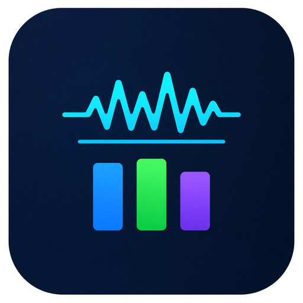

# IGP Performance Monitor

[English](../en/README.md) · [简体中文](../zh-CN/README.md) · [繁體中文](../zh-TW/README.md) · [日本語](README.md)

[ユーザーガイド](user-guide.md) · [トラブルシューティング](troubleshooting.md) · [全言語](../README.md)

[](https://github.com/MlsMoon/IGPPerformanceMonitor/actions/workflows/ci.yml)
[](https://github.com/MlsMoon/IGPPerformanceMonitor/releases/latest)
[](../../LICENSE)

Windows 向けのリアルタイムグラフィックス性能モニターです。[Intel PresentMon](https://github.com/GameTechDev/PresentMon) 2.4.1 をラップし、各フレームにシステム／プロセス指標（CPU、メモリ、NVIDIA GPU / VRAM）を付与して、PyQt5 でライブチャートを描画します。

<p align="center">
  
</p>

**管理者権限が必要です**（または Windows の *Performance Log Users* グループ）。PresentMon は ETW を使います。

アプリの UI は英語と簡体字中国語です。このフォルダは日本語マニュアルです。

## インストール

[GitHub Releases](https://github.com/MlsMoon/IGPPerformanceMonitor/releases/latest) から最新のインストーラまたはポータブル EXE を入手します。

| アセット | 用途 |
|---|---|
| `IGPPerformanceMonitor-Setup-x.y.z.exe` | 推奨。Program Files へインストールし、スタートメニューとアンインストーラを追加します。管理者権限を要求します。 |
| `IGPPerformanceMonitor.exe` | 単一ファイルのポータブル版（アプリ内更新でも使用）。 |
| `auto_updater.exe` | ヘルプ → 更新を確認 が使う内部差し替え用です。自分で起動しないでください。 |

パッケージ版は起動直後に GitHub Releases を確認し、直前の公開版へロールバックできます。

キャプチャ、チャート、CSV、オーバーレイの使い方は **[ユーザーガイド](user-guide.md)** を見てください。

## 機能

- 複数アプリの同時キャプチャ
- ライブチャート：FPS、フレームタイム、CPU / GPU / RAM / VRAM（アプリ別とシステム）
- 対象ウィンドウに追従する最前面オーバーレイ
- CSV の書き出し／読み込みとオフラインのスタッタ分析
- UI は英語と簡体字中国語（`IGP_LANG=en` または `zh_CN`）
- ダーク／ライトテーマ
- GitHub Releases からのアプリ内自己更新（SHA256 検証）

## 動作条件

- Windows 10 または 11（64 ビット）
- 管理者、または *Performance Log Users* グループ
- 実際にフレームを提示するゲーム／アプリ（バックグラウンドサービスは不可）
- GPU / VRAM / 電力 / 温度チャートは NVIDIA（NVML）推奨。AMD / Intel GPU でも PresentMon によるフレームタイミングは取れます

## ソースから実行

```bat
pip install -r requirements.txt
Scripts\run_dev.bat
```

```bat
python -m src.main --debug
```

ヘッドレスキャプチャ（管理者）。UAC 再起動後も `temp\` に書きたい場合は `Scripts\capture_debug.bat` を使ってください。

```bat
Scripts\capture_debug.bat --process-name Unity.exe --timed 10
python -m src.main --headless --process-name Unity.exe --timed 10
```

## ビルド

```bat
pip install -r requirements-dev.txt
Scripts\build.bat
Scripts\build_installer.bat
python Scripts\generate_manifest.py
```

出力先は `dist\` です。

- `IGPPerformanceMonitor.exe`
- `auto_updater.exe`
- `IGPPerformanceMonitor-Setup-<version>.exe`（[Inno Setup 6](https://jrsoftware.org/isinfo.php) が必要）
- `app_manifest.json`（GitHub Release のメタデータ）

既定ブランチは **`develop`** です。安定化とタグは **`release`** にあります。どちらも保護されています。

`release` 上に `VERSION` と一致する注釈付きタグ `vX.Y.Z` を付けると `.github/workflows/release.yml` が走り、上記ファイルが GitHub Release に公開されます。

## テスト

```bat
python -m src.tests
```

オフスクリーン Qt は自動で設定されます。`.claude/skills/test-after-changes/SKILL.md` と `.claude/skills/test-design/SKILL.md` を参照してください。

## コントリビュート / セキュリティ

- [CONTRIBUTING.md](../../CONTRIBUTING.md)
- [SECURITY.md](../../SECURITY.md)
- [CODE_OF_CONDUCT.md](../../CODE_OF_CONDUCT.md)
- [CHANGELOG.md](../../CHANGELOG.md)

## ライセンス

MIT。PresentMon は Intel 独自のライセンスで同梱されています。[第三者通知](../../THIRD_PARTY_NOTICES.md) を見てください。
