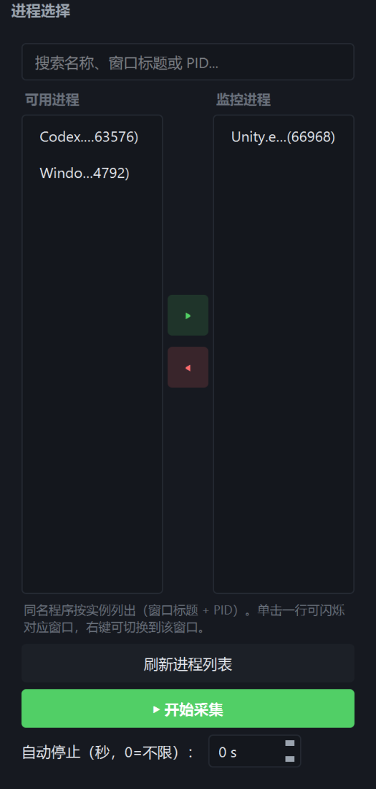
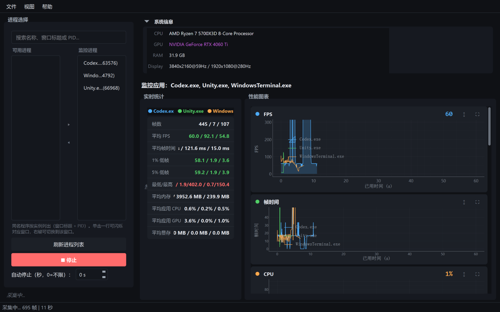
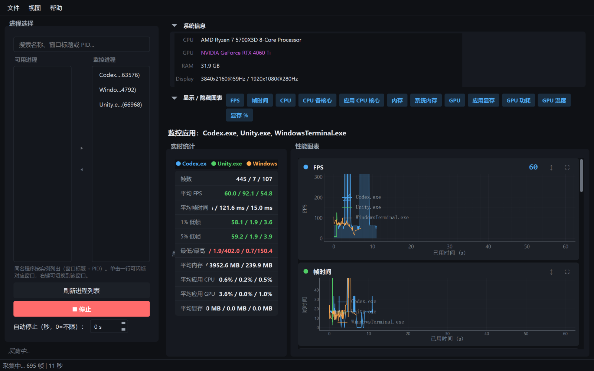
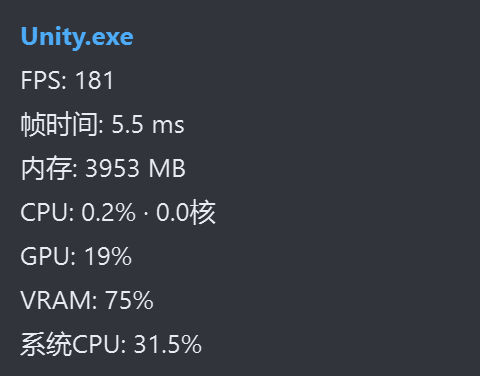
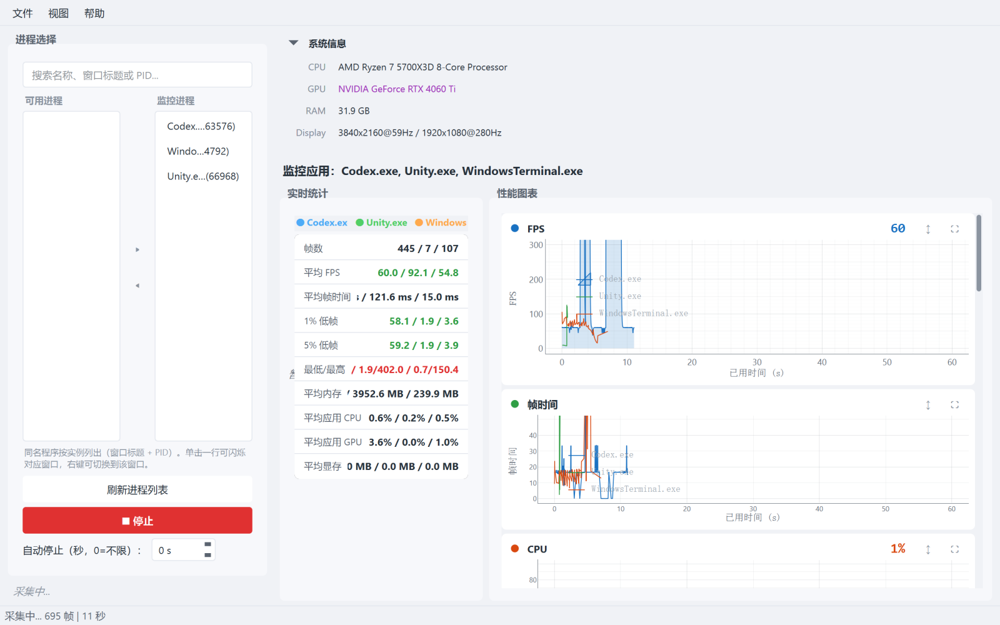
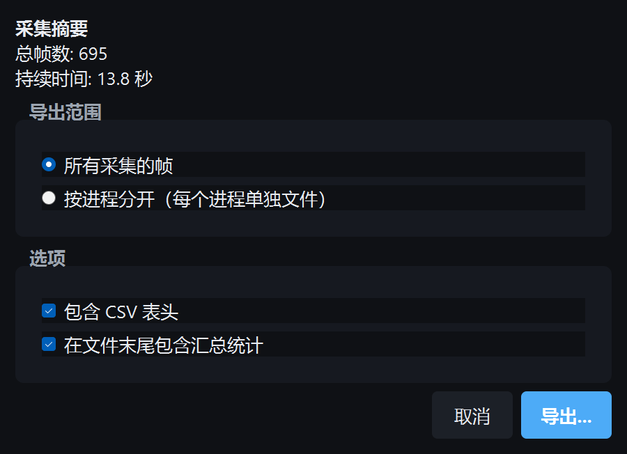
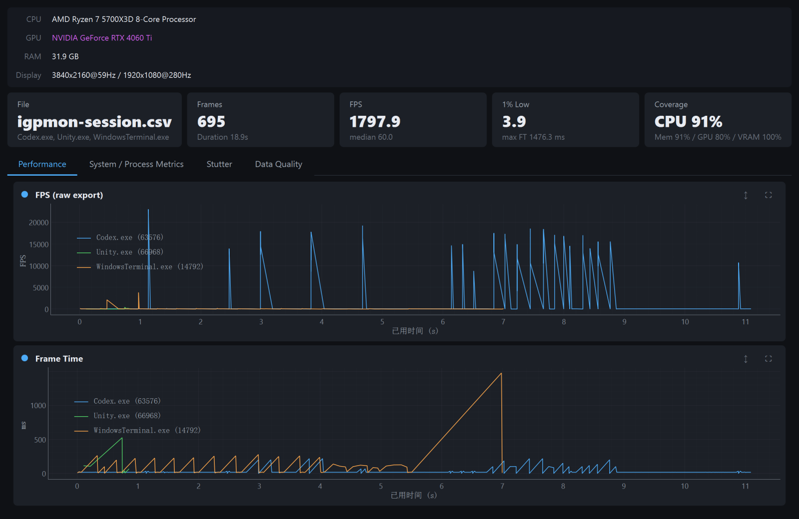

# 使用指南

[English](../en/user-guide.md) · [简体中文](../zh-CN/user-guide.md) · [繁體中文](README.md) · [日本語](../ja/user-guide.md)

面向已安裝的 Windows 程式。程式內 **說明 → 用戶手冊** 開啟的就是這份文件（介面為簡體「用户手册」）。安裝檔與從原始碼建置見 [README](README.md)。發生問題請看 [疑難排解](troubleshooting.md)。

## 目錄

1. [執行條件](#1-執行條件)
2. [安裝與首次啟動](#2-安裝與首次啟動)
3. [第一次擷取](#3-第一次擷取)
4. [主視窗](#4-主視窗)
5. [即時統計](#5-即時統計)
6. [圖表](#6-圖表)
7. [疊加視窗](#7-疊加視窗)
8. [主題與視窗](#8-主題與視窗)
9. [匯出 CSV](#9-匯出-csv)
10. [匯入 CSV 與離線分析](#10-匯入-csv-與離線分析)
11. [更新與還原](#11-更新與還原)
12. [介面語言](#12-介面語言)
13. [快速鍵](#13-快速鍵)
14. [無介面 / 命令列](#14-無介面--命令列)
15. [設定與記錄](#15-設定與記錄)
16. [指標詞彙](#16-指標詞彙)

## 1. 執行條件

- Windows 10 或 11，64 位元
- **系統管理員**權限，或加入「Performance Log Users」群組
- 遊戲或目標程式已經在執行（或先啟動，再按 **重新整理處理程序清單**）
- 需要 GPU %、顯示記憶體、功耗、溫度時，建議使用 NVIDIA（NVML）。其他顯示卡仍可透過 PresentMon 取得幀時間與幀率

程式使用 [Intel PresentMon](https://github.com/GameTechDev/PresentMon) 2.4.1 與 Windows ETW，因此必須提權。所有進入點在尚未提權時都會跳出 UAC。

## 2. 安裝與首次啟動

### 安裝程式

1. 從 [Releases](https://github.com/MlsMoon/IGPPerformanceMonitor/releases/latest) 下載 `IGPPerformanceMonitor-Setup-x.y.z.exe`。
2. 執行安裝程式（UAC）。預設安裝到 Program Files，並加入開始功能表捷徑。
3. 啟動 **IGP Performance Monitor**。若再次提示 UAC，請允許。

### 可攜版

可攜版：將 `IGPPerformanceMonitor.exe` 放到任意目錄。若沒有自動提權，請以滑鼠右鍵 → **以系統管理員身分執行**。

`auto_updater.exe` 是內部助手，請勿手動開啟。

套件版啟動約 1.5 秒後會靜默檢查 GitHub 是否有新版本。

若未設定 `IGP_LANG` 且 `config.json` 裡還沒有 `locale`，主視窗出現前會跳出 **Language / 语言**，可選 English 或簡體中文。選擇會儲存，之後可在 **設定 → 語言** 更改（介面語言仍只有英語與簡體中文）。

## 3. 第一次擷取

1. 先啟動遊戲或目標程式，讓它出現在處理程序清單中。
2. 左側 **處理程序選取** 面板可依 exe 名稱、視窗標題或 PID 搜尋。
3. 選取一個或多個**執行個體**，按 **▶**，或按兩下該列。同一個 exe 開兩份（例如兩個 Unity 編輯器、不同專案）會分成兩列：`Unity.exe  (pid)  —  視窗標題`。按一下列會閃爍對應視窗，右鍵可切換到該視窗。
4. 選擇性：**自動停止（秒）**。`0` 表示一直擷取到你手動停止。
5. 按 **開始擷取** 或按 **F5**。
6. 正常遊玩。觀看統計表與圖表。每個被監視的視窗上會出現疊加視窗。
7. 按 **停止** 或再按一次 **F5**。



監視清單會儲存（exe + 視窗標題），下次啟動自動還原。處理程序重啟後 PID 會變，重新整理清單再選一次即可。

圖形介面必須至少加入一個處理程序。監視整台電腦上所有處理程序只在[無介面模式](#14-無介面--命令列)可用（`--all-processes`），不適合即時介面。

若這次一幀都沒有，程式會提示：執行個體可能已結束，或目標並沒有在繪製。

## 4. 主視窗

截圖為程式內的簡體中文介面（與 `zh_CN` 相同）。



### 版面

| 區域 | 作用 |
|---|---|
| 左側面板 | 搜尋、可用處理程序、監視清單、開始 / 停止、自動停止計時 |
| 右側上方 | 系統資訊列（CPU、GPU、記憶體、顯示器）與即時統計表 |
| 圖表格線 | 每個指標一張卡片。FPS 可見時佔第一整列 |
| 狀態列 | 就緒 / 擷取中 / 錯誤，以及幀數與已經過時間 |

### 功能表

- **檔案** — 開始/停止擷取、匯入 CSV、匯出 CSV
- **檢視** — 各圖表顯示隱藏、圖表面板、疊加視窗顯示隱藏
- **設定** — 深色模式、視窗置頂、點選穿透、語言
- **說明** — 快速鍵、用戶手冊、檢查更新、版本歷程（還原）、更新紀錄、GitHub、關於

擷取進行中會鎖定搜尋、加入/移除與計時器。要改監視清單請先停止。

## 5. 即時統計

表格列出 **所有已設定的應用程式**，不只是已經出過幀的。還沒有幀的名稱會變淡並顯示「無幀」——可能是啟動器，或遊戲還在載入。

常見項目：

| 統計 | 意義 |
|---|---|
| 幀數 | 本次工作階段收到的幀 |
| 平均 FPS | 有效 FPS 樣本的平均 |
| 1% Low | 最慢的 1% 幀，以 FPS 表示（排序後 FPS 的 P99） |
| 5% Low | 最慢的 5%（P95） |
| 最小 / 最大 | 最差與最好 FPS |
| 平均幀時間 | 幀時間平均 |
| 平均 CPU / GPU / 記憶體 / 顯示記憶體 | 該應用程式本工作階段平均值 |

介面上的 FPS **曲線**會做輕度 EMA，避免無上限幀率時閃爍。**CSV 匯出仍是原始值。** 撰寫報告時請以 CSV 為準。

## 6. 圖表

### 圖表一覽

| 圖表 | 內容 |
|---|---|
| FPS | 分應用幀率（畫面上為 EMA） |
| 幀時間 | `1000 / fps`，毫秒（不做 EMA） |
| CPU | 應用 CPU %，並疊加整機曲線 |
| CPU 核心 | 每個邏輯核心一條曲線，粗線為平均 |
| 應用 CPU 核心 | 佔用的核心數（依每核 `cpu% / 100`） |
| 記憶體 | 應用工作集（MB） |
| 系統記憶體 | 整機已用記憶體（GB） |
| GPU | 應用 GPU %，並疊加整機（NVIDIA） |
| 應用顯示記憶體 | 分處理程序顯示記憶體（MB，NVML） |
| GPU 功耗 | 整卡功耗（W） |
| GPU 溫度 | GPU 溫度（°C） |
| 顯示記憶體 % | 整卡顯示記憶體佔用 |

### 顯示與隱藏



顯示或隱藏：

- **檢視 → 圖表**
- 介面內的 **圖表面板**（`Ctrl+J`）
- 在卡片上按右鍵 → **隱藏**

每張卡片可 **最大化**、**還原**、**自動調整**。顯示隱藏狀態存在 `%APPDATA%\IGPPerformanceMonitor\config.json`。沒有 GPU 後端時，GPU / 顯示記憶體 / 功耗 / 溫度預設隱藏。

格線隨視窗寬度重排（1–4 欄）。1080p 下圖表在捲動區域內，不會為了「塞下」而預設藏起來。

缺測是空白（`None`），不會寫成 `-1`。

## 7. 疊加視窗

### 顯示內容

開始擷取後，每個監視中的應用程式會有一個置頂疊加視窗，貼在該應用程式主視窗左上角附近並跟隨（約 30 fps）。目標最小化時疊加視窗會隱藏。

每個疊加視窗顯示：應用程式名稱、FPS（EMA）、幀時間、應用記憶體、應用 CPU（及佔用核心）、應用 GPU、整機顯示記憶體 %、整機 CPU。



### 操作

| 操作 | 方法 |
|---|---|
| 隱藏 / 顯示全部疊加視窗 | **F9** 或 檢視 → 顯示/隱藏疊加視窗 |
| 點選穿透 | 設定 → 點選穿透。滑鼠落到遊戲上。此後疊加視窗右鍵功能表不可用，請改用設定功能表 |
| 關閉單個疊加視窗 | 在疊加視窗上按右鍵（開啟穿透時無效） |

追蹤邏輯會選該處理程序最大的、可見的、有標題的非工具視窗。Unity 編輯器、瀏覽器、帶很多面板的 IDE 一般會跟主畫面，而不是浮動檢查器。

## 8. 主題與視窗

- **Ctrl+D** 或 設定 → **深色模式** 切換深淺色。Windows 原生標題列會一起變。
- **Ctrl+T** 或 設定 → **視窗置頂** 釘住主視窗。
- 分割列寬度（側欄 vs 圖表、統計 vs 圖表）與視窗位置會在下次啟動還原。



## 9. 匯出 CSV

有資料後：**檔案 → 匯出 CSV…** 或 **Ctrl+E**。

選項：

- **全部幀** — 一個檔案
- **依處理程序** — 每個應用程式一個檔案，放到選定資料夾
- 是否包含表頭
- 是否在檔案結尾附加彙總（平均 / 最小 / 最大 / 1% Low / 5% Low，以及應用 CPU 與記憶體）



編碼使用系統預設。檔案頂部的註解列記錄 CPU / GPU / 記憶體 / 顯示器、監視清單與匯出時間。

匯出的 FPS 是 **原始值**，不是畫面上的 EMA。

## 10. 匯入 CSV 與離線分析

**檔案 → 匯入 CSV…** 或 **Ctrl+I**。匯入會嘗試多種編碼。

分析視窗四個分頁：

| 分頁 | 內容 |
|---|---|
| Performance | 原始 FPS 與幀時間 |
| System / Process Metrics | 檔案中的 CPU、記憶體、GPU、顯示記憶體 |
| Stutter | 固定 33.3 ms / 50 ms 尖峰，以及相對近期基準約 2 倍的動態尖峰 |
| Data Quality | 各指標實際有多少列有值 |



匯入的 FPS 是 **原始值**，與 CSV 相同。無上限幀率的程式在此分頁可能出現尖峰；即時視窗的 FPS 圖使用 EMA。用來回顧上次工作階段或無介面擷取，不必再跑 PresentMon。

## 11. 更新與還原

### 檢查更新

僅 **套件化後的 EXE** 可用，從原始碼執行沒有自我更新。

- 啟動後不久會拉取最新 GitHub Release 上的 `app_manifest.json`。
- **說明 → 檢查更新…** 可立即再查一次。
- 下載會做 SHA256 驗證，再由 `auto_updater.exe` 替換 EXE 並重新啟動。

### 還原

- **說明 → 版本歷程** 可還原到上一份已儲存的發布版（如果有）。

開發模式會提示無法自我更新，這是正常的。

請勿透過物件儲存發佈更新。唯一管道是 GitHub Releases。

## 12. 介面語言

介面只有兩種：`en` 與 `zh_CN`。

1. 環境變數 **`IGP_LANG`** 優先（`en` 或 `zh_CN`）。
2. 否則使用 `%APPDATA%\IGPPerformanceMonitor\config.json` 裡儲存的 `locale`。
3. 否則，Windows 地區若以 `zh` 開頭則使用簡體中文。
4. 其餘情況為英語。

第一次啟動且既沒有 `IGP_LANG` 也沒有已儲存的 `locale` 時，會跳出雙語選擇（English / 简体中文）。之後可在 **設定 → 語言** 切換；切換會在同一行程裡重建主視窗，不必再過 UAC。

下次啟動時 `IGP_LANG` 仍會覆蓋已儲存的偏好：

```bat
set IGP_LANG=zh_CN
IGPPerformanceMonitor.exe
```

```bat
set IGP_LANG=en
python -m src.main
```

注意：繁體中文 Windows 在**程式介面**仍會對應到簡體中文（`zh_CN`）。本資料夾只提供繁體說明文件，不會改變介面語言。

## 13. 快速鍵

**F1** 或 說明 → 鍵盤快速鍵 開啟同一份清單。

| 快速鍵 | 作用 |
|---|---|
| **F5** | 開始 / 停止擷取 |
| **F9** | 顯示 / 隱藏疊加視窗 |
| **Ctrl+D** | 深色 / 淺色 |
| **Ctrl+E** | 匯出 CSV |
| **Ctrl+I** | 匯入 CSV |
| **Ctrl+J** | 顯示 / 隱藏圖表面板 |
| **Ctrl+T** | 視窗置頂 |
| **F1** | 快速鍵視窗 |
| 設定 → 點選穿透 | 疊加視窗不接收滑鼠（沒有單獨熱鍵） |

## 14. 無介面 / 命令列

沒有視窗。同一套擷取管線，寫出 CSV。

### 安裝版

已安裝的套件版：

```bat
IGPPerformanceMonitor.exe --headless --process-name game.exe --timed 30 -o C:\captures\run.csv
```

### 原始碼

原始碼（請優先使用指令碼，UAC 之後仍寫入 `temp\`）：

```bat
Scripts\capture_debug.bat --process-name Unity.exe --timed 10
```

### 參數

| 參數 | 意義 |
|---|---|
| `--headless` | 擷取到 CSV，無介面（`--capture-debug` 是舊別名） |
| `--process-name` | 可重複。例：`--process-name game.exe --process-name Discord.exe` |
| `--process-id` | 可重複的 PID |
| `--exclude` | 可重複，要排除的處理程序名稱 |
| `--all-processes` | 電腦上所有正在呈現的處理程序（很吵；不要在 GUI 這樣做） |
| `--timed N` | 秒數。`0` 表示直到 Ctrl+C |
| `-o` / `--output` | CSV 路徑。預設 `temp\igpmon-<應用>-<時間戳記>.csv` |
| `--debug` | 更詳細記錄（`igp_debug.log`） |
| `--no-track-display` / `--no-track-input` / `--no-track-gpu` | 關閉對應的 PresentMon 追蹤 |

無介面模式下省略 `--timed` 時預設 **5 秒**。

## 15. 設定與記錄

| 項目 | 位置 |
|---|---|
| 使用者設定 | `%APPDATA%\IGPPerformanceMonitor\config.json` |
| 更新狀態 / 備份 | 同一 AppData 目錄 |
| 除錯記錄（開發 / `--debug` / 無介面） | 存放庫或 EXE 旁的 `temp\igp_debug.log` |

`config.json` 儲存主題、介面語言、圖表顯示隱藏、視窗與分割列、疊加視窗穿透、監視清單與自動停止秒數。UTF-8 無 BOM。刪除即可重設（首次執行可能從舊登錄機碼還原一部分值）。

## 16. 指標詞彙

| 詞彙 | 定義 |
|---|---|
| FPS | 在 present 間隔有效時為 `1000 / MsBetweenPresents` |
| 幀時間 | 兩次 present 之間的毫秒數 |
| 1% Low / 5% Low | 排序後 FPS 清單的第 1 / 5 百分位（較差的幀，較低的 FPS） |
| 應用 CPU % | 該處理程序佔整機的份額（psutil，約 500 ms 取樣，不是每幀取一次） |
| 應用 CPU 核心 | 大約佔用了幾個核心 |
| 整機 CPU / 整機 GPU | 整機使用率 |
| 應用 GPU % | NVML 分處理程序使用率。可能短暫高於整機 GPU——兩套 NVIDIA API。NVML 沒有數值時，疊加視窗可能退回 PresentMon 忙碌時間估算 |
| 應用顯示記憶體 | 該處理程序的 NVML `usedGpuMemory` |
| 顯示記憶體 % | 整卡已用 / 總量 |
| GPU 功耗 / 溫度 | NVML 整卡感測器。只在快照裡，不會寫進每一列 CSV |
| Present 模式 | 應用程式如何呈現（例如 Hardware: Independent Flip） |
| Dropped | PresentMon 丟幀標記 |
| Click-to-photon / PC latency | 開啟對應追蹤時的 PresentMon 延遲欄 |

整機 CPU / GPU / 記憶體來自 **約 500 ms 的取樣執行緒**。若每幀呼叫 `cpu_percent()`，在 Windows 上會讀到 `0`。FPS 的介面曲線可能比 CSV 更平滑，因為只有 UI 使用 EMA。
